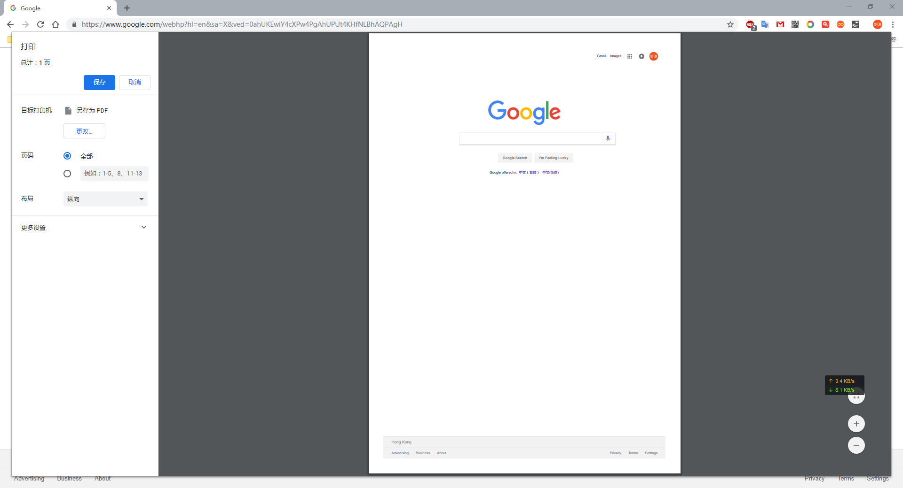
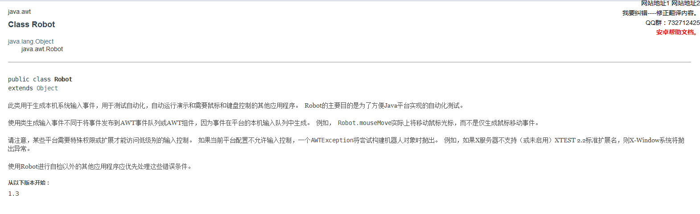

## java+selenium+autoIt 实现下载（打印）功能

selenium是一个开源的自动化测试框架，它可以模拟用户对浏览器的操作，进行自动化的测试。但是，它不仅仅只能用来做测试。

AutoIt 是一个使用类似BASIC[脚本语言](https://baike.baidu.com/item/%E8%84%9A%E6%9C%AC%E8%AF%AD%E8%A8%80/1379708)的[免费软件](https://baike.baidu.com/item/%E5%85%8D%E8%B4%B9%E8%BD%AF%E4%BB%B6/599405),它设计用于Windows GUI([图形用户界面](https://baike.baidu.com/item/%E5%9B%BE%E5%BD%A2%E7%94%A8%E6%88%B7%E7%95%8C%E9%9D%A2/3352324))中进行自动化操作。它利用模拟键盘按键，鼠标移动和窗口/控件的组合来实现自动化任务。而这是其它语言不可能做到或无可靠方法实现的(例如[VBScript](https://baike.baidu.com/item/VBScript)和[SendKeys](https://baike.baidu.com/item/SendKeys))。在这个项目中AutoIt 主要用于在浏览器中点击下载后，保存文件时，对windos弹框进行操作。

因为业务需求，需要把一个html网页转化成PDF，本来准备考虑用iText来对html转为PDF，但是我们已经拥有html的网页了，用iText感觉太麻烦，然后又找了一个第三方html->pdf，结果需要收费等一些其它原因，最终决定采用selenium+chrome+java+autol对网页进行导出PDF。

> 即使这个是打印成PDF，也可用于下载
>
> 环境:springboot v2.1.2 + maven + selenium 3.141.59 + chrome 71.0.3578.98

### 1 selenium

#### 1.1 关于selenium

selenium是一个自动化测试框架，可以模拟用户的浏览器操作，可以和几门热门的语言相结合，例如java，python，接下来我将使用selenuim来操作chrome来模拟用户将网页保存为PDF。

#### 1.2 selenium连接chrome

##### 1.2.1 添加selenium的jar包

```xml
				<!-- Selenium dependency -->
        <dependency>
            <groupId>org.seleniumhq.selenium</groupId>
            <artifactId>selenium-java</artifactId>
            <version>3.141.59</version>
        </dependency>

        <dependency>
            <groupId>org.seleniumhq.selenium</groupId>
            <artifactId>selenium-server</artifactId>
            <version>3.141.59</version>
        </dependency>
```

#####  1.2.2 下载谷歌浏览器驱动

[谷歌浏览器驱动下载](https://chromedriver.storage.googleapis.com/index.html?path=2.45/)

>  因为我用的是最新的chrome，所以下载的也是暂时最新的驱动，每个驱动对应的谷歌浏览器版本也不一样，你们可以查看相应的[文档](https://sites.google.com/a/chromium.org/chromedriver/downloads)，查看自己所对应的驱动

下载完驱动之后，将驱动放置于resource目录下的driver文件夹内

##### 1.2.3 加载WebDriver

```java

    /*获取浏览器的连接*/
    public static WebDriver openAccess() {

        //在idea运行的谷歌驱动路径
        System.setProperty("webdriver.chrome.driver",
                "src/main/resources/driver/chromedriver.exe");
        //打jar包后的谷歌驱动路径
		/*String driverPath = System.getProperty("user.dir")+File.separator+"driver"+ File.separator+"chromedriver.exe";*/
        HashMap<String, Object> chromePrefs = new HashMap<>();
        chromePrefs
                .put("profile.default_content_settings.popups", 0);//设置为禁止弹出下载窗口
        chromePrefs
                .put("download.default_directory", downloadFilepath);//设置为文件下载路径
        ChromeOptions options = new ChromeOptions();
        HashMap<String, Object> chromeOptionsMap = new HashMap<>();
        options.setExperimentalOption("prefs", chromePrefs);
        options.addArguments("--test-type");
        options.addArguments("disable-infobars");//取消Chrome正在受到自动测试软件的控制
       /*
        用户浏览器地址，用于加载浏览器的用户信息，
        这一步将增加浏览器的性能消耗，
        如果不加这一行，浏览器默认已访客模式进入浏览器，
        可根据自己的需求来选择是否使用
         */
        options.addArguments("user-data-dir=C:\\Users\\onegene\\AppData\\Local\\Google\\Chrome\\User Data");
        DesiredCapabilities cap = DesiredCapabilities.chrome();
        cap.setCapability(ChromeOptions.CAPABILITY, chromeOptionsMap);
        cap.setCapability(CapabilityType.ACCEPT_SSL_CERTS, true);
        cap.setCapability(ChromeOptions.CAPABILITY, options);
        WebDriver driver = null;
        boolean flag = true;
        while (flag) {
            try {
                flag = false;
                driver = new ChromeDriver(cap);
                //响应时间超过8秒，则重新开启浏览器连接
                driver.manage().timeouts().pageLoadTimeout(15, TimeUnit.SECONDS);
                driver.manage().window().maximize();
//                driver.get(url);

            } catch (Exception e) {
                flag = true;
                if (driver != null) {
                    driver.quit();
                }
                log.info("wait for connection browser ");
            }
        }
        return driver;
    }

```

①`System.setProperty("webdriver.chrome.driver","src/main/resources/driver/chromedriver.exe");`这一步用于在IDEA中运行的是否加载驱动，如果，打成jar包之后，加载驱动的话，应该用下面一行加载驱动，驱动放在与jar包同目录的dreiver目录下

```java
String driverPath = System.getProperty("user.dir")+File.separator+"driver"+ File.separator+"chromedriver.exe";
System.setProperty("webdriver.chrome.driver",driverPath);
```

②`options.addArguments("user-data-dir=" + DriverPathUtils.getChromePath());`用户浏览器地址，用于加载浏览器的用户信息，这一步将增加浏览器的性能消耗，如果不加这一行，浏览器默认已访客模式进入浏览器，可根据自己的需求来选择是否使用

#### 1.3 加载url，进行元素操作

```java
        webDriver.get(url);//自己定义
        Thread.sleep(1000);
				//根绝class寻找元素，并且点击
        WebElement addpBtn = webDriver.findElement(By.className("addp"));
        addpBtn.click();

        Thread.sleep(1000);
				//根据id寻找元素，并且点击
        WebElement genLayoutBtn = webDriver.findElement(By.id("genLayout"));
        genLayoutBtn.click();
```

> 注：selenium切换tab，并且关闭
>
> ```java
> String currentWin = webDriver.getWindowHandle();
> Set<String> handles = webDriver.getWindowHandles();
> for (String handle : handles) {
>     if (currentWin.equals(handle)) continue;
>     webDriver = webDriver.switchTo().window(handle);
> }
> webDriver.close();
> ```

#### 1.4调起打印事件

调起如下的谷歌浏览器打印事件



调起浏览器的打印事件有以下两种方法：

​	① 点击鼠标右键，然后点击打印按钮

​	②按住键盘的`Ctrl`+`P`

显而易见，第②中方法更实用，所以我们采用第②种

我查看了selenium的键盘事件，发现是有键盘事件的，调起方法如下：

```java
Actions action = new Actions(driver); 
action.keyDown(Keys.CONTROL);// 按下 Ctrl 键
action.sednKeys("p")//按下P键
action.keyUp(Keys.CONTROL);// 释放 Ctrl 键
action.perform()//发送组合按键
```

本来以为操作键盘的方法很简单，但是不知道为啥chrome一直无法调起键盘事件，谷歌了很久，也没有找到原因，网上也有很多人说无法调起。于是查看jdk文档，发现java提供了一个操作键盘事件的类。如下



