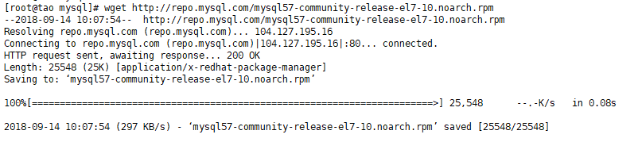
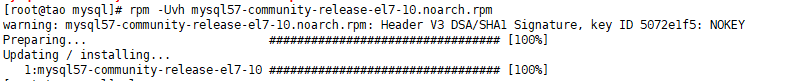
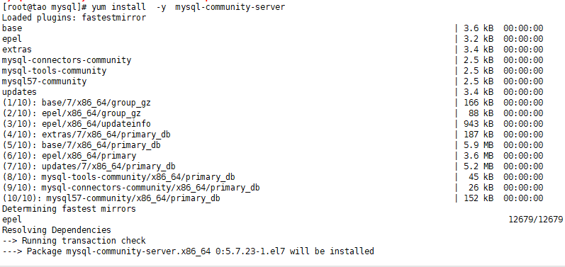
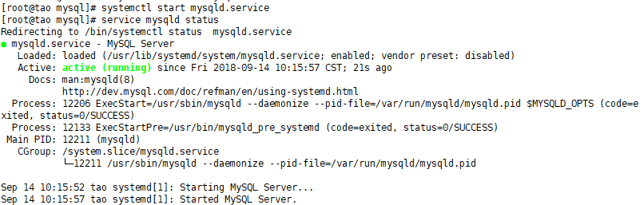
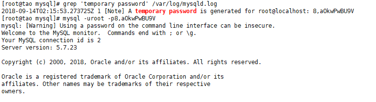
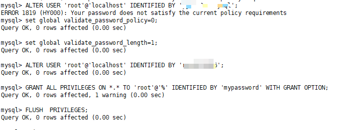
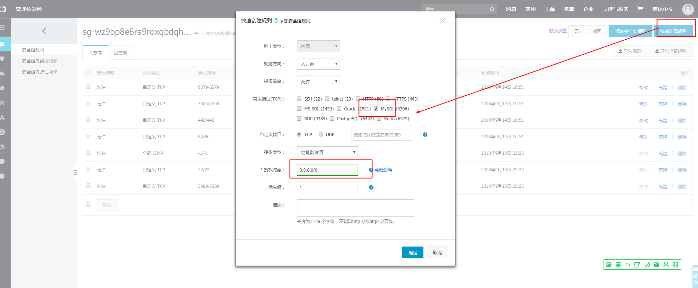

# mysql数据库安装

### 1. 从官网下载yum包

直接使用wget下载yum包

```sh
wget http://repo.mysql.com/mysql57-community-release-el7-10.noarch.rpm
```



### 2. 安装软件源

```sh
rpm -Uvh mysql57-community-release-el7-10.noarch.rpm
```



### 3. 安装Mysql服务端

```sh
yum install  -y  mysql-community-server
```



这一步需要从网络上下载数据，如果网速慢的话，可能需要一段时间

### 4. 启动Mysql

```sh
#启动mysql服务
service mysqld start
#启动Mysql客户端
systemctl start mysqld.service
```

### 5. 检测Mysql运行状态

```sh
#检测mysql服务运行状态
service mysqld status
#检测mysql客户端运行状态
systemctl status mysqld.service
```



### 6. 修改Mysql密码

> 为了加强安全性，MySQL5.7为root用户随机生成了一个密码，在error log中，关于error log的位置，如果安装的是RPM包，则默认是/var/log/mysqld.log。 
> 只有启动过一次mysql才可以查看临时密码

```sh
#查看Mysql密码
grep 'temporary password' /var/log/mysqld.log
#使用默认密码登录
mysql -uroot -p密码
#因为mysql5.7对密码有限制，不能设置过于简单的密码,否则报错ERROR 1819 (HY000): Your password does not satisfy the current policy requirements
#以下两行是更改密码限制
#修改密码的复杂度限制
set global validate_password_policy=0;
#修改密码的长度限制
set global validate_password_length=1;
#修改密码
ALTER USER 'root'@'localhost' IDENTIFIED BY '123456';
```





### 7. 授权其它机器登录

```sh
#授权所有其它机器以密码123456登录
GRANT ALL PRIVILEGES ON *.* TO 'root'@'%' IDENTIFIED BY '123456' WITH GRANT OPTION;
#授权指定ip地址为61.130.10.147的机器以密码123456登录
GRANT ALL PRIVILEGES ON *.* TO 'root'@'61.130.10.147' IDENTIFIED BY 'mypassword' WITH GRANT OPTION;
#刷新设置
FLUSH  PRIVILEGES;
```

### 8. 开启防火墙(服务器)

> 如果使用的Centeros系统买来的，例如阿里云或者腾讯云，这些就不必要在linux上开启端口了，因为服务商都有安全策略，所以，只需要配置安全组就好了。这里我演示的是阿里云

- 登录阿里云后台，进入需要修改的主机，选择安全组

  

- 配置规则

  

- 添加规则

  

- 查看规则是否生效

  

### 9. 开启防火墙(虚拟机)

```sh
#开启3306端口
iptables -I INPUT -p tcp -m state --state NEW -m tcp --dport 3306 -j ACCEPT
#查看规则是否生效
iptables -L -n # 或者: service iptables status
#关闭3306端口
iptables -D INPUT -p tcp -m state --state NEW -m tcp --dport 3306 -j ACCEPT
#添加这些规则后，重启后将失效，所以需要保存
service iptables save # 或者: /etc/init.d/iptables save
```

