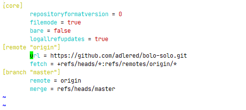

# 从0开始搭建博客

## 1. 概述

本篇博客，我教大家从0开始搭建一个 bolo博客，bolo 博客 和 solo 博客的区别是皮肤更加多，并且可以帐号密码登录。

本篇博客，将会使用到一下的相关知识：

- dokcer
- mysql
- 阿里云服务器
- nginx
- https
- java
- ...

## 2. docker

首先，我们需要购买一台阿里云的服务器，然后，就开始安装服务器的基本软件了，因为 solo 博客、mysql、nginx 等软件的安装都依赖 docker，所以，我们的第一步就是安装 docker 容器。

### 2.1 docker 的安装

因为系统是我们刚买的 ecs，所以无需像网上一样，yum 卸载 docker。

设置 docker 安装镜像，如果不设置的话，docker 安装起来会特别的慢。

```sh
sudo yum-config-manager \
    --add-repo \
    http://mirrors.aliyun.com/docker-ce/linux/centos/docker-ce.repo
```

> 这里我使用的是阿里云的镜像源

安装 docker

```sh
yum install docker-ce docker-ce-cli containerd.io
```

启动 docker

```sh
systemctl start docker
```

运行 docker hello world

```sh
docker run hello-world
```

### 2.2 设置 docker 的镜像加速

国内从 DockerHub 拉取镜像有时会遇到困难，此时可以配置镜像加速器。Docker 官方和国内很多云服务商都提供了国内加速器服务。这里我使用的镜像加速使用的是阿里云的。

阿里云镜像获取地址：https://cr.console.aliyun.com/cn-hangzhou/instances/mirrors，登陆后，左侧菜单选中镜像加速器就可以看到你的专属地址了：


配置阿里云镜像加速

```sh
sudo mkdir -p /etc/docker
sudo tee /etc/docker/daemon.json <<-'EOF'
{
  "registry-mirrors": ["https://zoi3dt5d.mirror.aliyuncs.com"]
}
EOF
sudo systemctl daemon-reload
sudo systemctl restart docker
```

## 3. nginx

### 3.1 安装 nginx

这里的 nginx 我采用的是 docker 安装，因为需要 nginx 配置域名的 https，因此，我们需要把 nginx 的配置文件挂载在主机目录

```sh
docker run -d --name nginx -p 80:80 -p 443:443 \
-v /opt/nginx/nginx.conf:/etc/nginx/nginx.conf \
-v /opt/nginx/logs:/var/log/nginx \
-v /opt/nginx/html:/usr/share/nginx/html \
-v /opt/nginx/conf:/etc/nginx/conf.d \
-v /opt/nginx/ssl:/root/ssl \
--privileged=true \
nginx
```

> 下面，我来解释下个参数的意义：
>
> - `-d`：后台运行 nginx 容器
> - `--name nginx`：指定 nginx 的容器名为 nginx
> - `-p 80:80`：将容器的 80 端口映射到主机 80 端口，ps：前面的端口为主机端口
> - `-p 443:443`：将容器的 443 端口映射到主机 443 端口， ps：443端口为 https 端口，后续配置 https 我们将使用到这个端口
> - `-v /opt/nginx/nginx.conf:/etc/nginx/nginx.conf`：将 nginx 的配置文件映射到主机，ps：前面为主机目录，后面为 nginx 的容器目录
> - `-v /opt/nginx/logs:/var/log/nginx`：将 nginx 的日志文件映射到主机
> - `-v /opt/nginx/html:/usr/share/nginx/html`：将 nginx 的 html 静态文件映射到主机
> - `-v /opt/nginx/conf:/etc/nginx/conf.d`：将 nginx 的配置文件夹映射到主机
> - `-v /opt/nginx/ssl:/root/ssl`：将 主机的 ssl https 密匙，映射到 nginx 的 /root/ssl 目录
> - `--privileged=true` ：容器用户运行 root 权限

我们可以使用一下的一些命令，查看容器的运行情况：

-  `docker ps` ：查看正在运行的容器，如果 nginx 运行成功了，这里会显示 nginx 的容器
- `docker exec -it nginx /bin/bash` ：进入 nginx 容器里面，查看容器内部的运行情况
- `docker stats`：查看容器的基本内存、cpu占用情况
- `docker logs nginx`：查看 nginx 容器运行的日志

### 3.2 docker 的一些命令

下面是以上的一些命令的截图：


## 4. mysql

### 4.1 安装 mysql

为了简单方便，我这里安装 mysql 的方式是采用 dokcer 安装。

```sh
docker run -d --name mysql -p 3306:3306 \
-v /opt/mysql/conf.d:/etc/mysql/conf.d \
-v /opt/mysql/data:/var/lib/mysql \
-e MYSQL_ROOT_PASSWORD=我的密码 \
mysql
```

> 以下是相关命令解释：
>
> `-p 3306:3306`：将容器的 3306 端口映射到主机
>
> `-v /opt/mysql/conf.d:/etc/mysql/conf.d`：将 mysql 的配置文件映射到主机
>
> `-v /opt/mysql/data:/var/lib/mysql`：将 mysql 的数据文件映射到主机
>
> `-e MYSQL_ROOT_PASSWORD=我的密码`： 设置 mysql  root 密码

### 4.2 mysql 允许外网访问

进入 mysql 容器

```sh
docker exec -it mysql /bin/bash
```

登录 mysql

```sh
mysql -uroot -p
```

设置 root 可外网访问

```sh
GRANT ALL ON *.* TO 'root'@'%'; 
flush privileges; 
```

开放阿里云服务的 3306 端口，使用 Navicat 进行连接吧！

## 5. bolo

### 5.1 安装 git

```sh
yum install git
```

### 5.2 拉取源码

```sh
git clone https://github.com/adlered/bolo-solo.git
```

如果拉取的速度很慢，可按照我下面的方式，设置一个镜像：

浏览器下载一个 `GitHub` 加速的插件，下载完成后刷新页面，GitHub页面会变成下面：


选择合适的镜像，下载即可，

下载完成后，修改 `.git/config` 



### 5.3 构建镜像

我们是需要 https 访问的，所以需要做如下的操作：

前往项目根目录下`src/main/resources`目录，编辑`latkes.properties`文件，将`http`修改为`https`，即可使用 https 访问。

进入项目根目录，执行一下的命令

```sh
docker build -t "bolo" .
```

### 5.4 运行 bolo

运行下面的脚本 

```sh
docker run -it -d -p8080:8080 \
--env RUNTIME_DB="MYSQL" \
--env JDBC_USERNAME="root" \
--env JDBC_PASSWORD="**" \
--env JDBC_DRIVER="com.mysql.cj.jdbc.Driver" \
--env JDBC_URL="jdbc:mysql://172.18.0.24:3306/bolo_blog?useUnicode=yes&characterEncoding=UTF-8&useSSL=false&serverTimezone=UTC" \
--rm \
bolo --listen_port=8080 --server_scheme=https --server_host=blog.booleandev.xyz
```

> 参数解释：
>
> `-p8080:8080`：容器与主机的端口映射
>
> `--env RUNTIME_DB="MYSQL"`:	数据库
>
> `--env JDBC_USERNAME="root"`：	数据库用户名
>
> `--env JDBC_PASSWORD="**"` ：数据库密码
>
> `--env JDBC_DRIVER="com.mysql.cj.jdbc.Driver"`：数据库驱动
>
> `--env JDBC_URL="jdbc:mysql://172.18.0.24:3306/bolo_blog?useUnicode=yes&characterEncoding=UTF-8&useSSL=false&serverTimezone=UTC"`：数据库链接
>
> `--listen_port=8080`：bolo容器监听端口
>
> `--server_scheme=https`：http or https
>
> `--server_host=blog.booleandev.xyz`：域名

### 5.5 相关解释

相信大家注意到，bolo 连接的数据库链接为 `172.18.0.24`，而不是 `127.0.0.1`，这是为什么呢？

因为 bolo 博客和主机运行的不是一个网络，所以无法通过 `127.0.0.1` 进行访问，容器和宿主机的网络通信是桥接，那么宿主机和docker会有两个网卡，eth0和docker0，docker0是容器之间的一个路由，eth0是宿主机的ip路由，两个路由可以直接通信，所以，只要找到宿主机的eth0网卡即可。

下面是我的网卡信息：

```sh
[root@booleandev .git]# ifconfig
docker0: flags=4163<UP,BROADCAST,RUNNING,MULTICAST>  mtu 1500
        inet 172.17.0.1  netmask 255.255.0.0  broadcast 172.17.255.255
        inet6 fe80::42:51ff:fe42:367d  prefixlen 64  scopeid 0x20<link>
        ether 02:42:51:42:36:7d  txqueuelen 0  (Ethernet)
        RX packets 453368  bytes 233613690 (222.7 MiB)
        RX errors 0  dropped 0  overruns 0  frame 0
        TX packets 496030  bytes 492850722 (470.0 MiB)
        TX errors 0  dropped 0 overruns 0  carrier 0  collisions 0

eth0: flags=4163<UP,BROADCAST,RUNNING,MULTICAST>  mtu 1500
        inet 172.18.0.24  netmask 255.255.240.0  broadcast 172.18.15.255
        inet6 fe80::216:3eff:fe02:edf2  prefixlen 64  scopeid 0x20<link>
        ether 00:16:3e:02:ed:f2  txqueuelen 1000  (Ethernet)
        RX packets 1798448  bytes 2109780912 (1.9 GiB)
        RX errors 0  dropped 0  overruns 0  frame 0
        TX packets 632237  bytes 320525103 (305.6 MiB)
        TX errors 0  dropped 0 overruns 0  carrier 0  collisions 0

lo: flags=73<UP,LOOPBACK,RUNNING>  mtu 65536
        inet 127.0.0.1  netmask 255.0.0.0
        inet6 ::1  prefixlen 128  scopeid 0x10<host>
        loop  txqueuelen 1000  (Local Loopback)
        RX packets 372  bytes 73305 (71.5 KiB)
        RX errors 0  dropped 0  overruns 0  frame 0
        TX packets 372  bytes 73305 (71.5 KiB)
        TX errors 0  dropped 0 overruns 0  carrier 0  collisions 0

veth1376aef: flags=4163<UP,BROADCAST,RUNNING,MULTICAST>  mtu 1500
        inet6 fe80::30c7:fdff:fe57:22fd  prefixlen 64  scopeid 0x20<link>
        ether 32:c7:fd:57:22:fd  txqueuelen 0  (Ethernet)
        RX packets 41327  bytes 41068253 (39.1 MiB)
        RX errors 0  dropped 0  overruns 0  frame 0
        TX packets 38087  bytes 35132337 (33.5 MiB)
        TX errors 0  dropped 0 overruns 0  carrier 0  collisions 0

```

因此，solo 容器需要访问数据库，只需要使用 `eth0`地址即可

### 5.6 验证 solo 部署成功

以上，solo 的本地部署就完成了，所以我们需要验证下是否部署成功，使用

```sh
curl 127.0.0.1:8080
```

如果出现了 html，则说明部署成功了

如果出现相应的错误的话，则只需要 `dokcer run` 时，把 `-d` 参数去除，即可以看到错误信息

## 6. https

### 6.1 申请 https 证书

https 证书一般可以到你购买域名的位置申请即可。我这里使用的是腾讯云生成的证书，下载完文件后，出现以下几个文件：


因为我们采用 nginx，所以只需要把 Nginx 下的两个文件移到 nginx 的映射目录 `/opt/nginx/ssl` 下即可

### 6.2 配置 nginx

修改 `/opt/nginx/nginx.conf`

```nginx

user  nginx;
worker_processes  1;

error_log  /var/log/nginx/error.log warn;
pid        /var/run/nginx.pid;


events {
    worker_connections  1024;
}


http {
    include       /etc/nginx/mime.types;
    default_type  application/octet-stream;

    log_format  main  '$remote_addr - $remote_user [$time_local] "$request" '
                      '$status $body_bytes_sent "$http_referer" '
                      '"$http_user_agent" "$http_x_forwarded_for"';

    access_log  /var/log/nginx/access.log  main;

    sendfile        on;
    #tcp_nopush     on;

    keepalive_timeout  65;

    #gzip  on;
	# 为了避免文件过长，将其它的配置包含进来
    include /etc/nginx/conf.d/*.conf;
}

```

编写 `/opt/nginx/conf/blog.conf`

```nginx
server {
	listen       443 ssl http2;
	server_name  blog.booleandev.xyz;
	ssl_certificate      /root/ssl/1_blog.booleandev.xyz_bundle.crt;
	ssl_certificate_key  /root/ssl/2_blog.booleandev.xyz.key;

	ssl_session_cache    shared:SSL:1m;
	ssl_session_timeout  5m;

	ssl_ciphers  HIGH:!aNULL:!MD5;
	ssl_prefer_server_ciphers  on;
	
	# 文件目录
	location / {
		 proxy_pass http://172.18.0.24:8080;  # 内网IP
		 proxy_set_header HOST $host;
		 proxy_set_header X-Real-IP $remote_addr;
		 proxy_set_header X-Forwarded-For $proxy_add_x_forwarded_for;
		 proxy_set_header X-Forwarded-Proto $scheme;
		 proxy_set_header X-Forwarded-Scheme $scheme;
	}
}
server {
	listen 80;
	server_name blog.booleandev.xyz;
	return      301 https://$server_name$request_uri;
}
```

### 6.3 修改域名解析

域名解析添加一个 A 记录，我这里使用的是腾讯云的域名，配置页面大致如下：


## 7. 成功

输入 `https://blog.booleandev.xyz`，即成功！


## 8. 参考文章

- [CentOS Docker 安装](https://www.runoob.com/docker/centos-docker-install.html)
- [Docker 镜像加速](https://www.runoob.com/docker/docker-mirror-acceleration.html)
- [使用docker安装nginx](https://juejin.cn/post/6844904016086827016)
- [docker搭建的nginx代理宿主机服务](https://juejin.cn/post/6844904063063048200)
- [Docker 安装 MySql](https://juejin.cn/post/6844903925296922631)
- [方法② 传统 Docker 方式安装菠萝博客](https://doc.stackoverflow.wiki/web/#/7?page_id=44)