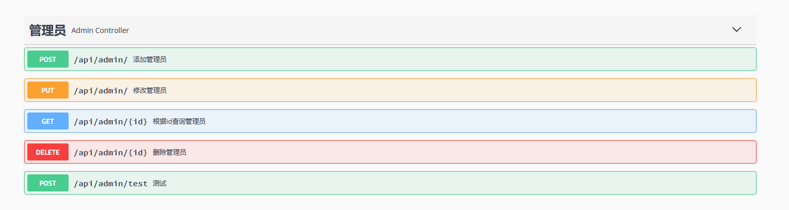
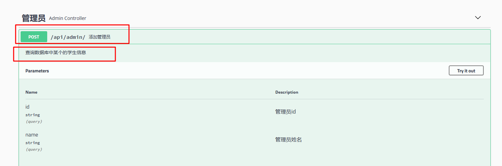
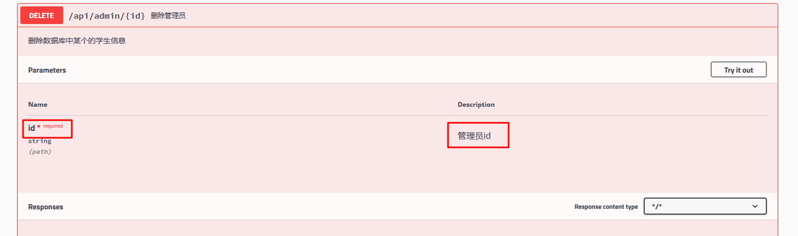
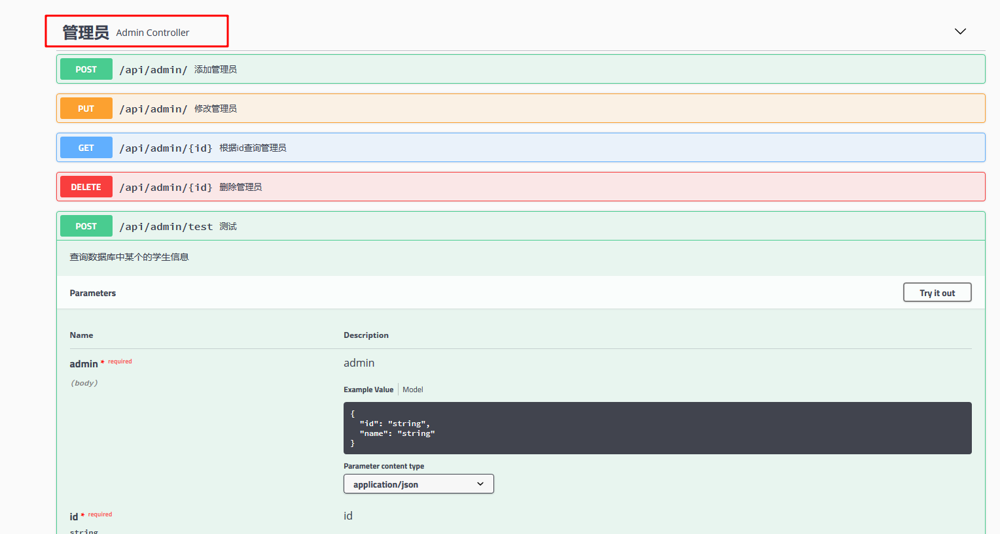
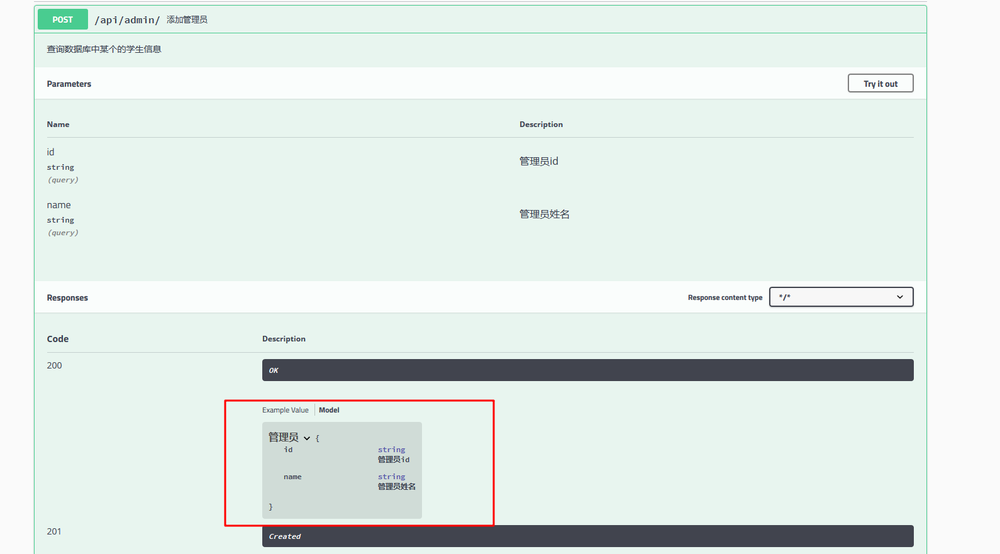
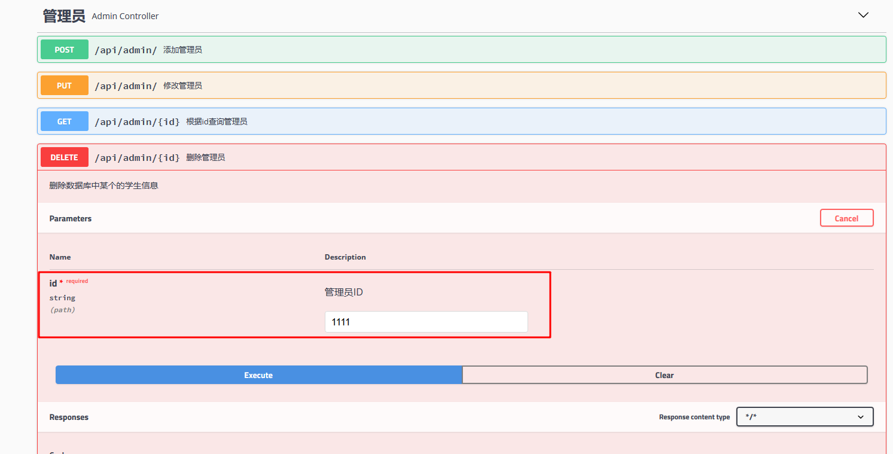

## swagger注解详情

### 1. @Api()

作用于类，放置于controller的一个类上，标志这个类是swagger资源

#### 1.1参数：

| 参数名称 | 参数介绍               | 备注 |
| -------- | ---------------------- | ---- |
| value    | 说明，可以使用tags替代 |      |
| tags     | 说明                   |      |

#### 1.2实例代码：

```java
@Api(value = "swagger2测试api", tags = "管理员")
@RequestMapping("/api/admin")
public interface AdminFeign {
  
}
```

#### 1.3示例图：




### 2. @ApiOperation()

作用于方法之上，用户表示一个http的请求

#### 2.1 参数

| 参数名称   | 参数介绍             | 备注                |
| ---------- | -------------------- | ------------------- |
| value      | 方法描述             |                     |
| notes      | 方法描述详情         |                     |
| tags       | 标签，可继承类的标签 | 可不填              |
| response   | 返回类型             | class，可不填       |
| httpMethod | 请求方法             | get，post等，可不填 |

#### 2.2 示例代码

```java
@ApiOperation(value = "添加管理员", notes = "查询数据库中某个的学生信息")
@RequestMapping(value = "/", method = RequestMethod.POST)
Admin post(Admin admin);
```

#### 2.3 示例图



### 3. **@ApiParam()** 

作用于方法，用于参数字段的说明

#### 3.1 参数

| 参数名称 | 参数介绍 | 备注 |
| -------- | -------- | ---- |
| name     | 参数名称 |      |
| value    | 参数解释 |      |
| required | 是否必需 |      |

#### 3.2 示例代码

```java
@ApiOperation(value = "删除管理员", notes = "删除数据库中某个的学生信息")
@RequestMapping(value = "/{id}", method = RequestMethod.DELETE)
Admin delete(@ApiParam(name = "id", value = "管理员id", required = true)@PathVariable("id") String id);
```

#### 3.3 示例图



### 4. @ApiModel()

作用于类，对类进行说明，用于实体类接收或者返回

#### 4.1 参数

| 参数名称    | 参数介绍 | 备注 |
| ----------- | -------- | ---- |
| value       | 对象名   |      |
| description | 对象描述 |      |

#### 4.2 代码演示

```java
@Data
@ApiModel("管理员")
public class Admin {
    /**
     * 管理员id
     */
    @ApiModelProperty(value = "管理员id")
    private String id;
    /**
     * 管理员姓名
     */
    @ApiModelProperty(value = "管理员姓名")
    private String name;
}
```

#### 4.3 示例图



### 5. @ApiModelProperty()

作用于实体类，用于实体类中某个字段

#### 5.1 参数

| 参数名称 | 参数解释 | 备注 |
| -------- | -------- | ---- |
| value    | 参数解释 |      |
| name     | 参数名称 |      |
| dataType | 属性类型 |      |
| required | 是否必填 |      |
| example  | 示例     |      |
| hidden   | 隐藏     |      |


#### 5.2 示例代码

```java
@Data
@ApiModel("管理员")
public class Admin {
    /**
     * 管理员id
     */
    @ApiModelProperty(value = "管理员id", name = "id", required = true)
    private String id;
    /**
     * 管理员姓名
     */
    @ApiModelProperty(value = "管理员姓名", name = "name", required = true)
    private String name;
}
```

#### 5.3 示例图



### 6. @ApiImplicitParams()

作用于方法之上，解释请求参数里边添加@ApiImplicitParam()注解

#### 6.1 参数

| 参数名称  | 参数解释 | 备注 |
| --------- | -------- | ---- |
| name      | 参数名称 |      |
| value     | 参数解释 |      |
| paramType | 参数类型 |      |
| required  | 是否必需 |      |

#### 6.2 示例代码

```java
 @ApiOperation(value = "删除管理员", notes = "删除数据库中某个的学生信息")
 @ApiImplicitParams({
        @ApiImplicitParam(name = "id", value = "管理员ID", paramType = "path", required = true)
    })
 @RequestMapping(value = "/{id}", method = RequestMethod.DELETE)
 Admin delete(@PathVariable("id") String id);
```

#### 6.3 示例图片



